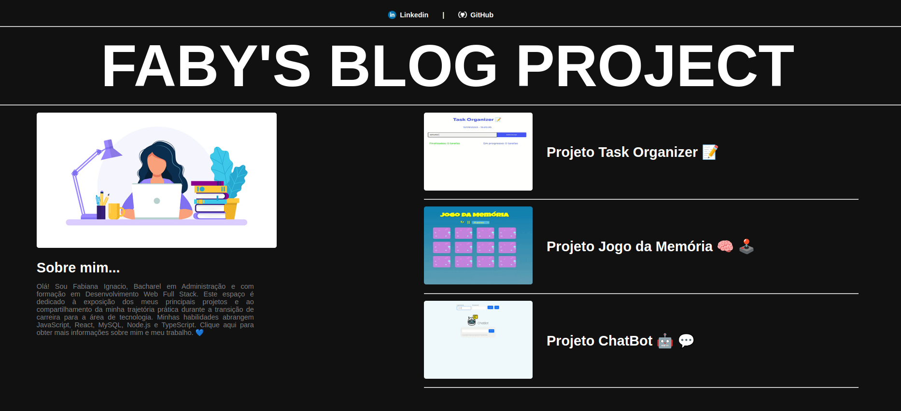

# FABY'S BLOG PROJECT

  

https://angular-project-blog.vercel.app/
   

 

## Descrição do Projeto

O **FABY'S BLOG PROJECT** é um projeto criado com Angular, inspirado em um layout da plataforma Dribbble. Ele tem como objetivo ser um blog pessoal para compartilhar projetos. Este projeto foi desenvolvido como parte da aplicação prática dos conteúdos iniciais do curso de Angular no bootcamp Santander - DIO.

## Funcionalidades

O projeto demonstra a aplicação dos seguintes conceitos do Angular:

1. **Componentização:** O projeto é composto por quatro componentes principais:
   - **Menu Bar:** A barra de menu superior para navegação.
   - **Menu Title:** O título exibido na página.
   - **Big Card:** Um componente para mostrar projetos em destaque.
   - **Small Card:** Um componente para exibir projetos menores.

2. **Ciclo de Vida:** O projeto utiliza o ciclo de vida dos componentes para garantir que as informações sejam carregadas e atualizadas de forma eficiente.

3. **Rotas:** O aplicativo possui duas rotas principais:
   - **Home:** Agrega o conteúdo principal, renderizando os quatro componentes.
   - **Content:** Exibe a página de detalhes de um projeto individual, que é preenchida com dados de um banco de dados local chamado `dataFake`.
